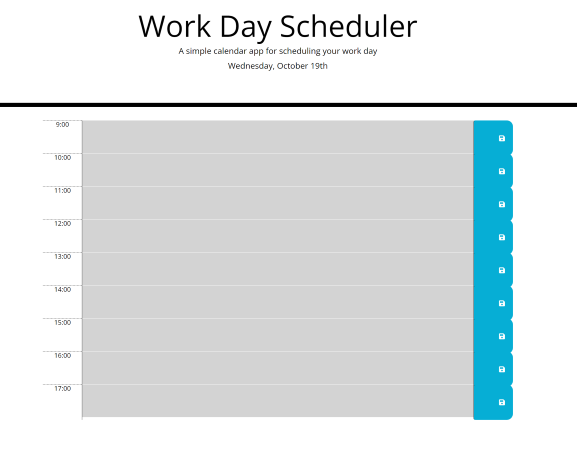

# Day Scheduler

## Description

AS AN employee with a busy schedule

I WANT to add important events to a daily planner

SO THAT I can manage my time effectively

## Table of Contents

- [Usage](#usage)
- [Technologies](#technologies)
- [Screenshots](#screenshots)
- [Questions](#questions)

## Usage

Here's a link to the <a href="#">Day Scheduler</a> deployed application

## Technologies

- Javascript
- jQuery
- Bootstrap
- Moment JS

## Screenshots

**Daily schedule**

## Questions

**How to reach me**

- <a href="https://github.com/joesen-dev">Joseph</a>
